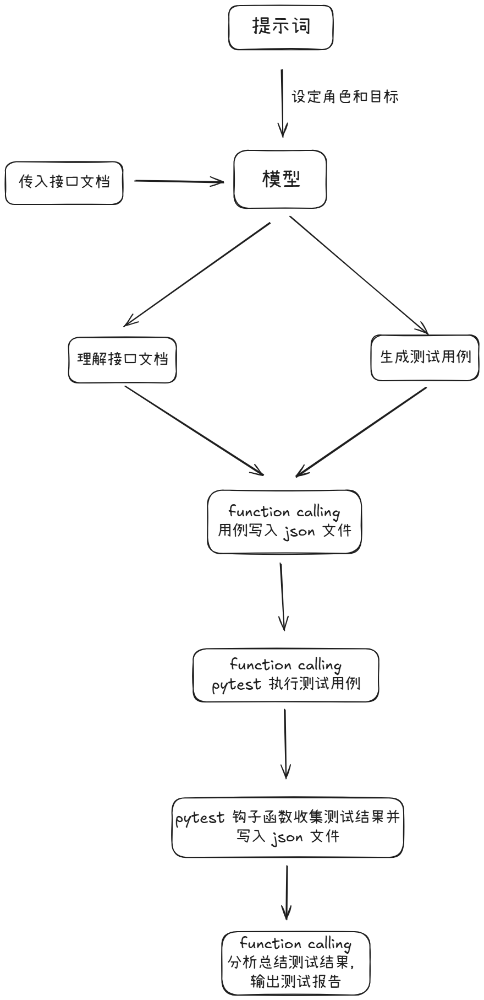
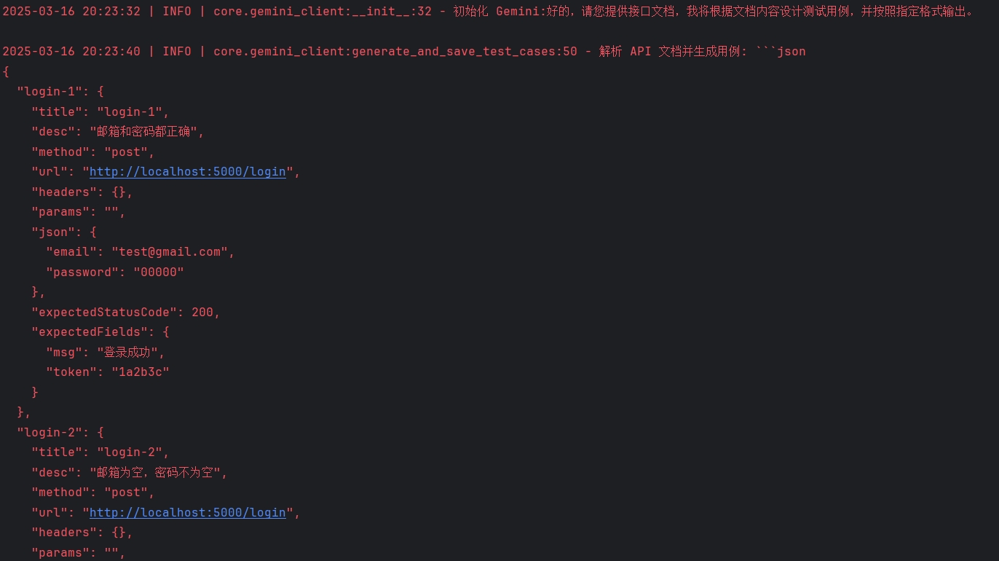
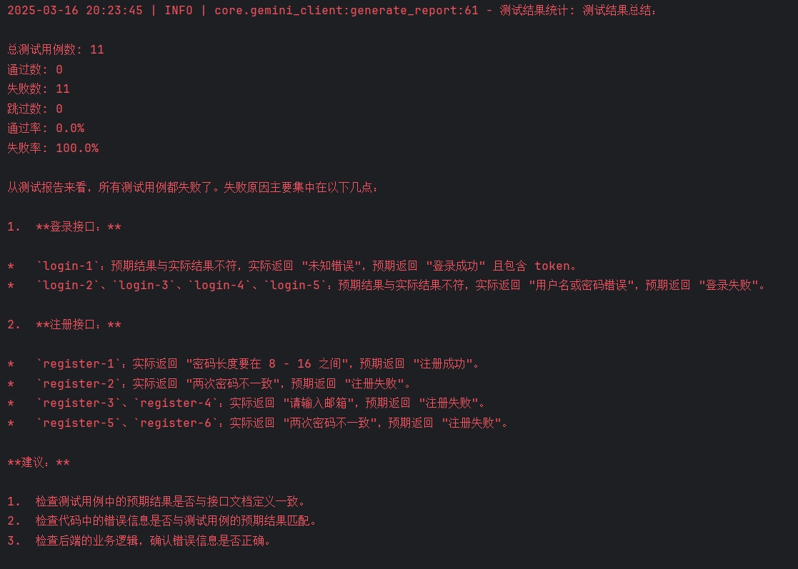

<h1 align="center">StarRing</h1>

接口自动化测试 Agent, 练手 demo, 基于大语言模型 + function calling 开发。


## 工作流
<div align="center">
    
</div>

## 使用方法
1. 获取你想要使用的模型的 `api key` 并将它填到 `model_info.toml` 文件中对应的地方
2. 安装 uv 工具(如果没有安装的话): https://docs.astral.sh/uv/getting-started/installation/
3. 安装环境依赖
```commandline
uv sync
```
4. 在 `main.py` 里面修改你想要用哪个模型执行
```python
if __name__ == '__main__':
    gemini = GeminiClient()
    main(gemini)

    """
    or: 
    
    gpt = GPTClient()
    main(gpt)
    
    deepseek = DeepSeekClient()
    main(deepseek)
    
    ... ...
    
    """
```
5. 准备一份符合 `OpenAPI` 规范的接口文档，而且必须是 `json` 格式的，将其命名为 `openapi.json`，并放到 `files` 目录下。 不想改名也可以，你只需要保证 json 接口文档的名称和 `path_conf.py` 里配置的接口文档名称一致即可。
6. 如果你在 IDE 例如 `Pycharm` 中，那么可以直接点击按钮执行 `main.py` 文件
7. 如果你想用命令执行，那么可以使用以下命令
```commandline
uv run main.py
```


> 如果你不没有接口文档，那么可以用 files 包里已存在的接口文档

你需要先启动 `test_server` 包里的 `flask_server.py`，这是一个简单的 `api` 服务。
`flask_server` 启动后直接运行 `main.py` 文件即可。


## 结果输出
<div align="center">
    
    
</div>